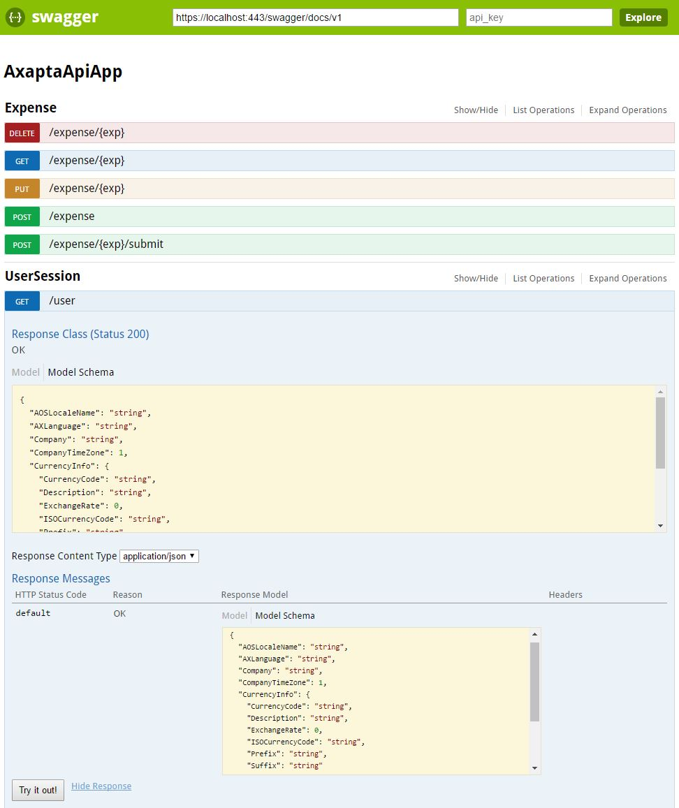

### Service endpoints

**1. UserSession controller**

Retrieves information about the current user session. Two operations are available:

> https://\<_your-webapp-url:port_\>/user  

Calls the '_GetUserSessionInfo_' service operations from the standard '_UserSessionService_' system service.

> https://\<_your-webapp-url:port_\>/auth  

Retrieves the current logged user identity and lists all available claims.

**2. Expense controller**

A simple example to demonstrate how to consume an AIF service using the '_ExpenseServices_' Basic Inbound Port. Three operations are available using different actions (GET, PUT, DELETE, POST).

> https://\<_your-webapp-url:port_\>/expense/  
> https://\<_your-webapp-url:port_\>/expense/{id}  
> https://\<_your-webapp-url:port_\>/expense/{id}/submit  

    For detailed information check Swagger real-time documentation below.  

### Company specific data

When calling an endpoint that retrieves company specific data, the default company setup for the current user is used. To select another company you should include the query parameter `company=<id>` in the URL. This works automatically for any operation on any available resource.

`GET` https://localhost:44300/customers?company=USRT

**Note:** When calling from a browser you may want to force the results to be displayed as XML or JSON. This is possible using the parameter `type` in the URL, adding `type=JSON` or `type=XML`.

`GET` https://localhost:44300/user?type=JSON

### Real-time documentation

AxaptaAPI uses [Swagger](http://swagger.io/) for interactive documentation and client SDK generation. To access it just open the address:

> https://\<_your-webapp-url:port_\>/swagger

It's possible to verify the endpoints, response schema, parameters and try it any of the endpoint specifying your own parameters/body.
