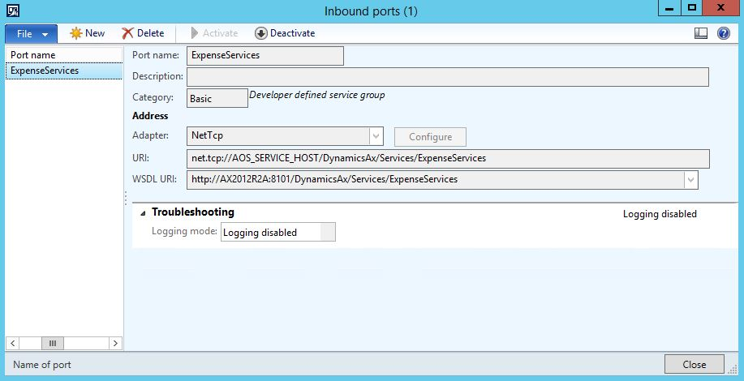
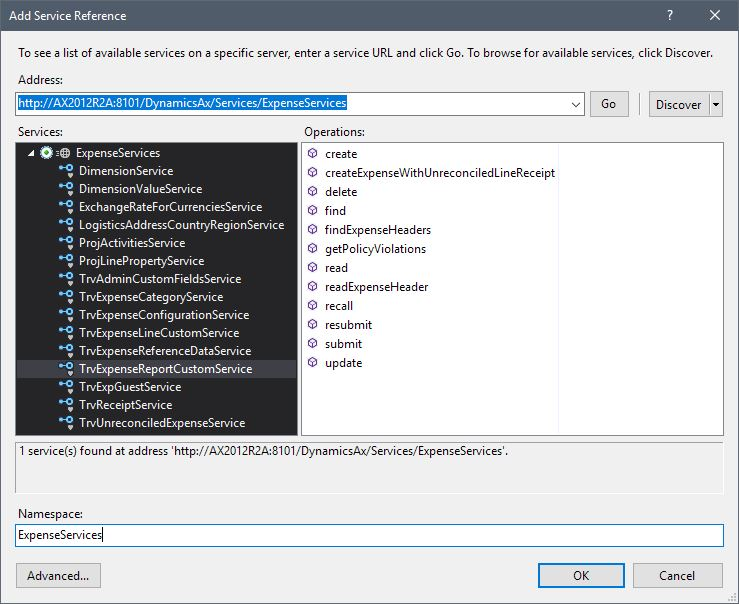
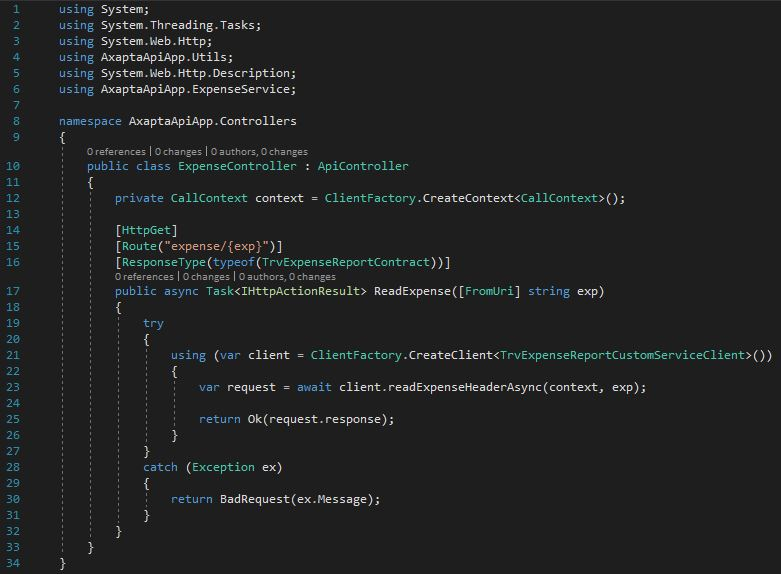
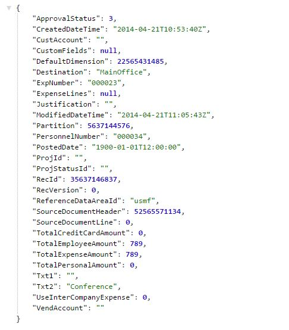

### Custom Controllers

To extend the API functionality and create new controllers, follow the steps below:

1 - Setup and activate your AIF Inboud port for the service you want to wrap, and copy the WSDL URI.

2 - On Visual Studio, add a _Service Reference_ using the WSDL URI from your AIF service.

3 - Right-click on Controllers folder, select _Add -> Controller_, choose "_Web API 2 Controller - Empty_" and name it as "_ExpenseController_"

4 - Replace the default code (blank class) by this sample:

5 - Rebuild your project, deploy and open the new URL

> https://\<_your-webapp-url:port_\>/expense/\{expense-number\}

`GET` https://localhost:44300/expense/000023

### Caching

To add Cache functionality on controller operations, only two steps are required. First add the reference to the filters namespace on your controller class:

`using AxaptaApiApp.Filters;`

Then, add the attribute `[CacheFilter]` on top of you method declaration:

`[CacheFilter]`  
`public async Task<IHttpActionResult> Get([FromUri] string expNumber) { ... }`  

**NOTE:** Use cache carefully. For more information, check the [MemoryCache class documentation](https://msdn.microsoft.com/en-us/library/system.runtime.caching.memorycache(v=vs.110).aspx).  
